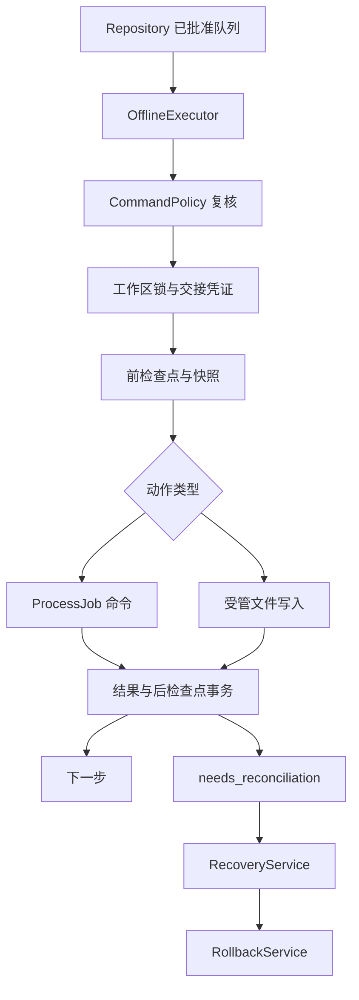

# 设计：安全离线执行与恢复

完整审阅稿；产品代码尚未实现。

## 概览
串行执行已批准计划，在实际副作用前后持久化事实。通过 Windows Job Object 管理进程树生命周期，通过快照和内容比较保护已有文件；无法证明结果时暂停核对。

目标是明确的执行能力与恢复边界。非目标：通用沙箱、对任意脚本提供回滚、跨文件系统和网络服务的分布式事务。

## Boundary Commitments

### 本规格拥有
CommandPolicy、WorkspaceLock、ProcessJob、OfflineExecutor、SnapshotStore、RollbackService、RecoveryService 的行为与文件。执行授权与账本记录是不同概念，不能相互替代。

### Out of Boundary
不拥有网络状态算法、数据库迁移、CLI 参数解析、云端规划、MCP 协议及 Harness 暂停政策。

### Allowed Dependencies
只依赖 foundation 的 Models/Repository/AuditLog，以及 Python pathlib/hashlib/os/asyncio、psutil、Windows pywin32。Windows 为本次验收平台，其他平台返回 unsupported_platform；跨平台支持需要单独验证，不能因 Python 可运行就宣称支持。

### Revalidation Triggers
授权 hash 规则、动作 schema、快照布局、领取/完成协议或 Job Object 启动方式改变时，重新验证 MCP 写接口、daemon 交接与重启恢复。

## 架构与流程

每轮仅执行一个步骤；领取后失败也必须落状态，不存在“pop 后丢失”。恢复事件立即关闭新领取开关，不在任意指令中间强行快照。

## File Structure Plan

| 文件 | 职责 |
|---|---|
| src/yunyi/policy.py | 本地动作审批与规范化 hash |
| src/yunyi/workspace_lock.py | Windows 字节范围锁及交接凭证校验 |
| src/yunyi/process_job.py | 挂起创建、Job 附加、恢复启动、输出排空与进程树清理 |
| src/yunyi/offline_executor.py | 步骤驱动循环、有限重试与收尾 |
| src/yunyi/snapshots.py | 路径、快照、hash 与容量控制 |
| src/yunyi/rollback.py | 精确逆序恢复及补偿 |
| src/yunyi/recovery.py | 孤儿核对、报告、版本化决策 |
| tests/unit/test_policy.py、test_executor.py、test_recovery.py | 状态与策略测试 |
| tests/integration/test_process_job.py、test_workspace_lock.py、test_snapshots.py、test_rollback.py、test_crash_recovery.py | Windows、文件、锁和真实崩溃验证 |

基础模型和表由 foundation 唯一维护。新增执行字段必须回到上游规格，再重验下游。

## 组件与接口

### CommandPolicy
`evaluate(action: Action, context: ExecutionContext) -> PolicyDecision`；decision 为 allowed、pending_approval、denied，包含 reason_code、action_hash、policy_hash。

- 默认允许内置只读动作及受管 file_write（需要预先授权文件清单）；外部程序默认不获许可。原稿的 ls/cat/pytest/npm test 字符串仅作为配置迁移提示。
- profile 保存实际 exe 规范绝对路径、可选文件 hash、允许 argv 模式（默认精确列表）、允许 cwd、写入清单、risk 与回滚能力。禁止仅 startswith 匹配。
- 默认拒绝 cmd/PowerShell/sh/bash、解释器 `-c/-e`、.bat/.cmd/.ps1 和管道/重定向 token。单纯参数含 `&` 在 shell=False 下并非注入，但保守默认规则仍拒绝不明组合。
- git 仅允许显式 profile 中的只读子命令及参数；禁止 checkout/reset/clean/stash、-c、外部 diff、任意可执行 helper 参数。pytest/npm 会运行任意项目代码，必须由用户对精确 profile 授权，不能当内置无副作用命令。
- action_hash 含 schema、exe、argv、cwd、declared_writes、风险、补偿；配置变化导致 policy_hash 变化，旧批准失效。
- 本地批准通过 CLI 的显式确认及终端交互写 approvals，绑定步骤 hash。MCP 没有授予批准的工具。直接修改配置是工作区所有者的信任操作。
- 高风险已拒绝动作不能用通用 --yes 绕过；确需支持先调整具名本地策略再重审。

### WorkspaceLock
`acquire(workspace: Path, owner_id: str) -> WorkspaceLease`；Windows `msvcrt.locking` 锁本地 `.yunyi/locks/<normalized_path_hash>.lock` 的首字节，文件句柄活到执行结束。锁只协调 Yunyi，不阻止第三方编辑器。

`HandoffEvidence`：generation、harness_process_identity、mode(cooperative|process_suspended|none)、verified_at、writer_permission。集成层只有在合作停止新工作且当前本地写操作完毕，或用户已结束 Harness 后，才能发 writer_permission。普通 psutil 暂停仅 best_effort，不自动赋予 writer_permission；默认仅允许无写操作或等待用户。

对内置 file_write 逐次比较 before hash，并在 write/rollback 前重新检查路径，覆盖外部编辑器冲突。任意外部程序不是受隔离写入，只有用户明确批准的 trusted profile 可运行，不能声称阻止其所有越界副作用。

### ProcessJob
`async run(argv: list[str], cwd: Path, env: Mapping[str,str], timeout: float, cancel: Event) -> ProcessResult`。

Windows 流程：解析 exe → CreateProcess(CREATE_SUSPENDED，隐藏非交互窗口，句柄只继承专用 stdin/out/err) → CreateJobObject 设置 KILL_ON_JOB_CLOSE 且禁止 breakaway → AssignProcessToJobObject → ResumeThread。附加失败时终止尚未启动的进程，禁止降级成无管理运行。

包装交互式 Harness 的终端继承由集成规格单独负责，此组件用于离线非交互命令。异步 reader 持续排空 stdout/stderr，超限后丢弃多余字节但继续读取；到期先设取消，最多一秒后 TerminateJobObject，等待最多两秒并报告存活身份。保存 pid + create_time，不能按旧 PID 操作新进程。控制进程崩溃时关闭 Job 自动终止后代；真实中断后仍必须核对外部副作用。

### SnapshotStore
`prepare(action, lease) -> SnapshotManifest`；`inspect(manifest) -> list[FileObservation]`；`restore(manifest, expected_after) -> RollbackResult`。

- 默认 `.yunyi/snapshots/<session>/<attempt>/`，内容寻址 blob；manifest 含相对路径、是否存在、SHA256、长度、只读属性、必要 mtime、快照格式版本。
- 拒绝绝对路径、`..`、盘符/UNC、NTFS ADS、保留设备名、末尾点/空格歧义、任何父目录/文件的 reparse point 或 junction。普通文件只接受单硬链接；拒绝无法证明归属的目录入口。
- 内置 file_write 仅支持 UTF-8 文本普通文件，原有字节原样备份；不创建/删除目录树，不操作 symlink、注册表或远程对象。
- 写快照到同目录临时文件，flush+fsync，再 os.replace；manifest 提交后才可写目标。容量默认每步 100MiB，计划预估超限提前拒绝。
- 写目标同样使用同目录临时文件 + replace，写入前后二次检查原文件 hash。Windows 并发外部编辑仍可能存在极窄竞态；此版本以本地受信目录为前提，不能作抵御恶意并发进程的安全保证。
- 成功后记 after hash；恢复仅在 current hash 等于该 after hash 时进行。目标已外部修改，报告 conflict；未知 after hash 不自动覆盖。新文件也只在 hash 匹配且由本 attempt 创建时删除。
- 内置 write 的 expected_before_sha256 与当前不一致立即拒绝。快照恢复还原任务开始前脏内容，不调用 git checkout/stash。Git 仅辅助生成差异。

### OfflineExecutor
`async run(session_id: str, stop: Event, handoff: HandoffEvidence) -> ExecutionSummary`。
claim_next → policy 复核 → acquire workspace → prepare snapshots → record_before → run action → observe changes → finish_step。策略/快照拒绝必须撤销有效领取并记录 blocked 原因，不隐匿 running。

每 task 按 steps.ordinal 顺序；depends_on 全成功才可领取。失败任务的依赖为 blocked，不跨失败步继续。重试 max_retries 默认 0，总尝试最多 4；只接受 declared idempotent、已批准、上次明确失败且不会造成未知副作用的动作；间隔 1/2/4 秒，恢复/取消能打断退避。

收到 stop：不再 claim；当前步骤最多执行至自己的 deadline。取消后副作用无法确认则 needs_reconciliation。进程退出 0 仅代表命令层成功，若后检查点或文件观察失败仍未知，不能进入 succeeded。

### RollbackService
`rollback(session_id, checkpoint_id, operation_id, expected_report_version, context: ExecutionContext | None = None) -> RollbackResult`。

所有恢复副作用（快照还原、补偿、重新排队后的执行）必须使用与正向执行相同的规范工作区锁和有效写入交接。外部CLI/MCP调用没有context时，服务先取得锁，再在锁内验证当前会话工作区、最新report_version、审批hash以及实时HandoffEvidence；Harness未交权、锁被占用或凭证陈旧则在任何文件变化前拒绝。不能把调用者提供的布尔值当交接证明。

锁持续覆盖版本/哈希检查、所有快照恢复或补偿、逐步结果落库及最终操作状态提交，完成或进入明确unknown状态后才释放。正向执行失败触发内部回滚时，传入仍持有的非序列化ExecutionContext（含活句柄和owner），验证同工作区/owner后复用，不能重复抢锁造成自锁；服务不得关闭借用锁。MCP无法序列化或创建此内部context。

锁内先检查所属会话、批准范围和版本，再调用Repository.begin_rollback冻结逆序清单；相同operation_id/内容返回已有状态，不同内容冲突。每子项通过claim_rollback_step取得独立lease并提交running/start，再产生副作用，之后finish_rollback_step原子提交applied/end。已有applied项不重复补偿；孤儿running只转needs_reconciliation，禁止重跑。遇到conflict/失败停止后续依赖性回滚并返回partial；数据历史不删除。

### RecoveryService
`build_report(session_id) -> RecoveryReport`；`apply_decision(session_id, report_version, decision, local_approval) -> RecoveryResult`。
Report 包含递增 version、状态统计、unknown_steps、changes、conflicts、rollback_results、last_checkpoint。

restart 流程：取得工作区锁 → 验证旧所有者 pid/create_time 不存在 → 将 running 标记 needs_reconciliation → 对内置动作比较 before/after 和预期内容 hash。如果可以唯一证明动作完成，生成可审阅核对证据；否则保持未知。用户确认保留/回滚/重新排队需精确 step 和报告 version；重新排队仅在证明未执行或显式批准接受重复风险后新建 attempt，不覆盖原记录。

apply_decision也在同一工作区锁内重验report_version、当前审批及交接，调用RollbackService时借用ExecutionContext；只读build_report可以不持写锁，但每份报告版本必须来自一致数据库快照。多会话共享目录时，任一回滚/恢复副作用与其他会话正向执行互斥。

云端返回 decision 只是建议；不能签发 local_approval。yunyi recover 无云也可导出报告及列出待确认决策。

## 错误与安全
稳定错误码：policy_denied、approval_required、workspace_busy、handoff_unverified、unsupported_platform、job_assignment_failed、path_escape、snapshot_corrupt、snapshot_limit、rollback_conflict、stale_report、needs_reconciliation。
所有未知结果失败关闭；禁止 `git checkout -- .`、`git reset --hard`、全局 `stash` 作为自动回滚。

## 需求追踪与验证

| 需求 | 组件 | 验证 |
|---|---|---|
| 1.1, 1.2, 1.3, 1.5 | CommandPolicy | exe替换、参数注入、审批hash、解释器/shell拒绝 |
| 1.4 | WorkspaceLock | 两执行器竞争、未交接不写、合作与best_effort区别 |
| 2.1, 2.2, 2.3, 2.4, 2.5 | OfflineExecutor | DAG、前检查点失败、原子完成、重试上限、恢复收尾 |
| 3.1, 3.2, 3.3 | ProcessJob | 父子输出洪流、超时清理、控制器崩溃、附加失败 |
| 4.1, 4.2, 4.3, 4.6 | SnapshotStore | 脏文件、新文件、外部修改、junction/ADS、容量与损坏 |
| 4.4, 4.5 | RollbackService | 逆序、父子操作幂等、逐项start/end、部分失败、无能力拒绝 |
| 1.4, 4.3, 5.4 | RollbackService、WorkspaceLock | 另一会话正向执行与CLI/MCP回滚竞争，锁内重验交接/审批/版本，嵌套复用无自锁 |
| 5.1, 5.2, 5.3, 5.4 | RecoveryService | 动作完成但落库前kill、重启核对、旧报告、重复决策 |

最小闭环先使用受管 file_write 与一次已批准的只读 fixture 命令；外部真实项目测试命令另行验收。所有磁盘实验使用临时目录，不对用户现有仓库执行破坏性故障注入。
