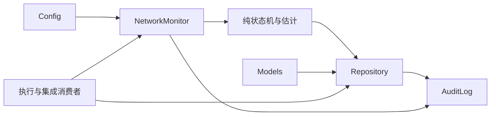

# 设计：状态与持久化基础

完整审阅稿；本文件是后续代码契约，不表示已经实现。

## 概览

以少量有类型模块提供网络事实与事务账本。状态机是纯函数，探测和时钟可替换；持久化采用短事务，外部进程不会在数据库事务内运行。

目标是可测、可恢复、可追踪；非目标是命令执行、进程暂停、云模型调用及通用事件平台。

## Boundary Commitments

### 本规格拥有
- Config、NetworkSnapshot、Plan/Task/Step 等共享数据类型及 schema 版本。
- NetworkMonitor 的采样、状态转换、窗口估计、持续稳定等待。
- Repository 的数据库结构、事务、归属校验、执行凭证与事件查询。
- AuditLog 的脱敏、限长及聚合指标。

### Out of Boundary
- execution 拥有实际动作与恢复决策；integration 拥有进程编排和用户入口。
- 不对命令副作用提供数据库级恰好执行一次保证。

### Allowed Dependencies
Python asyncio/sqlite3/tomllib、httpx、pydantic；不导入 execution、CLI、MCP 或 Harness。

### Revalidation Triggers
模型字段、schema 版本、状态机计数、主目标选择、事务/凭证规则改变时，重跑 execution 与 integration 的契约测试、MCP schema 和恢复闭环。

## 架构

技术：Python 3.11+、Pydantic 2.13.5、httpx 0.28.1、标准 sqlite3。spike 实测 SQLite 3.51.1，使用 DELETE/FULL；WAL 暂不作为配置选项。

## File Structure Plan

| 文件 | 职责 |
|---|---|
| pyproject.toml | 包元数据、Python 下限、依赖、测试配置；最初可安装包，不提前注册尚不存在的 CLI |
| src/yunyi/__init__.py | 版本，无启动副作用 |
| src/yunyi/models.py | 不含业务 IO 的严格输入输出模型 |
| src/yunyi/config.py | 合并配置、解析路径、参数验证 |
| src/yunyi/state_machine.py | 状态转移与连续计数 |
| src/yunyi/network.py | 并行目标探测、滑窗、等待、取消 |
| src/yunyi/persistence.py | Repository 和迁移调度 |
| src/yunyi/migrations/001_initial.sql | 所有基础表、约束和索引 |
| src/yunyi/observability.py | JSONL 事件脱敏、限长与指标 |
| tests/unit/test_models.py、test_config.py、test_state_machine.py、test_network.py、test_observability.py | 对应契约的行为测试 |
| tests/integration/test_persistence.py | 真实多连接事务与崩溃恢复测试 |
| tests/conftest.py | 本地隔离路径、注入时钟，不注入生产行为 |
| tools/tdd_gate.py | 调用原始 agentic-tdd 验证器并加严真实失败、审查完整性门禁 |
| tests/workflow/test_tdd_gate.py | 不存在运行器、零测试、收集错误、测试篡改负对照 |

## 组件与接口

### Config

`load_config(path: Path | None, environ: Mapping[str,str], overrides: dict) -> Config`。
支持四个 YUNYI 环境变量（SESSION_ID、DB_PATH、LOG_LEVEL、OFFLINE_MODE）；其他键不从任意环境隐式获取。默认数据库位于用户目录 `.yunyi/yunyi.db`；工作区取会话创建时解析的绝对路径，后续不能偷偷替换。

命名兼容约定：进程启动解析配置时，新变量存在则采用新变量（空值仍按既有规则校验），仅当新变量不存在时一次性读取对应 NETPILOT_* 旧名；两者不合并、不回写环境，使用旧名时每进程仅提示一次弃用信息且不输出变量值。该别名解析仍属于原配置任务1.2，不增加或重排任务。历史数据迁移见docs/naming-migration.md；本轮仅迁移命名约定，没有实现配置读取器。

network 字段：targets 列表含 id/url/role，primary_target，probe_interval_ms=3000，timeout_ms=2000，stable_success_threshold=3，offline_failure_threshold=3，healthy_latency_ms=1000，stable_window_min_seconds=30。
offline：max_parallel=1、max_output_bytes=65536、snapshot_limit_bytes=104857600、step_timeout_seconds=120、retry_limit=0。所有数值有有限上界；targets 1..8，超时不超过 30000ms，单步骤不超过 3600s。

### NetworkMonitor

`async probe_once() -> NetworkSnapshot`；`async start(stop: asyncio.Event) -> None`；`snapshot() -> NetworkSnapshot`；`async wait_for_stable(min_seconds: float, timeout: float) -> bool`。

- HTTP GET/HEAD 不携带 API 密钥，TLS 验证开启，不跟随重定向到任意主机。收到任意 HTTP 响应表明连通；401/403 单列 auth_required，不用于证明可推理。IP 目标使用 TCP 443；只作为辅助诊断。
- 主服务决定 connectivity，备用服务不构成多数票；选择主服务由集成适配器配置。
- 同一轮使用并发 IO 并各自两秒超时。按单调时钟三秒启动一轮；慢轮不重叠，跳过已错过的 tick，不在完成后再固定睡三秒。
- 可达但延迟高于健康阈值不增加失败计数，清零健康成功计数。连续两次高延迟使 stable 降级；失联计数独立。
- 初态 unstable；一次失联即从 stable 降级，第三次失联 offline；offline 首次可达 recovering，第三次连续健康成功 stable；recovering 不可达立即 offline。
- 所有计数只计算已完成轮次；状态转换时不把同一次采样重复计数。退出 offline 的首次健康采样计为 1。
- 网络取消不是失败样本。系统时间跳变不影响等待与窗口，UTC 只用于显示/持久化。

`NetworkSnapshot`：schema_version=1，state 枚举，quality/confidence float[0,1]，stable_window_seconds int[0,45]，observed_at UTC，age_seconds，stale bool，primary_target，probes，consecutive_successes/failures。
最近 60s 样本：success_ratio 为可达比例，latency_factor=max(0,1-p95_latency_ms/timeout_ms)，quality=clamp(success_ratio*latency_factor)，confidence=min(sample_count/20,1)*success_ratio；稳定时估计 int(45*quality*confidence)，否则 0；不足三样本为 0。它是启发式，不是校准概率。`wait_for_stable` 使用实际进入 stable 后的连续时长，任何离开 stable 重置。

### 共享模型

Pydantic strict，extra=forbid，有限列表与字符串，reject bool 作为整数。JSON 总量最多 1MiB，每计划最多 100 个任务、每任务 20 步，描述最多 4096 字符。

`Plan`：schema_version=1，plan_id str[1..128]，network_budget_seconds int[1..300]，tasks:list[TaskSpec]。session_id 由调用绑定而非信任模型输出。

`TaskSpec`：id、description、depends_on:list[str]、steps:list[StepSpec]、risk:low|medium|high、rollback_on_failure:bool。

`StepSpec`：id，action（判别联合），timeout_seconds，idempotent:bool，max_retries:int[0..3]，rollback（snapshot|compensation|none）。
- command：kind=command、argv:list[str]、cwd 相对路径、policy_profile、declared_writes:list[str]。
- file_write：kind=file_write、path 相对路径、content_utf8、expected_before_sha256（新文件为 null）、rollback=snapshot。
- compensation：只引用另一完整 command 动作，不能嵌套补偿或任意字符串脚本。

`StepLease`：session_id、plan_id、task_id、step_id、owner_id、attempt_id(UUID)、version、started_at。持久化比较全部归属键和 attempt_id/version；令牌不可在普通查询或日志暴露。
`StepResult`：status(succeeded|failed|timed_out|cancelled|needs_reconciliation)、exit_code nullable、duration_ms、stdout/stderr摘要、truncated bool、observed_file_changes、error_code。

计划内任务依赖使用本 plan 的局部 id，不允许跨 plan 指针。幂等性存储 hash 为严格验证后的规范 JSON（排序键、UTF-8、固定分隔符）的 SHA256。

### Repository

每次公开方法独立连接，foreign_keys=ON，busy_timeout=5000，synchronous=FULL。首次创建强制 journal_mode=DELETE。若现有文件是 WAL 且运行时低于 3.51.3（允许已修复 3.44.6、3.50.7 支线），拒绝打开写入并给出人工迁移指引，不悄悄改日志模式。

| 方法 | 后置条件 |
|---|---|
| ensure_session(session_id, workspace, harness) -> Session | 幂等、工作区冲突报错 |
| save_plan(session_id, plan) -> PlanReceipt | 原子保存计划和任务，重复 hash 幂等 |
| enqueue(session_id, plan_id, approved_ids) -> QueueReceipt | 仅改变有有效审批的任务状态，不执行 |
| claim_next(session_id, owner_id) -> StepLease或None | BEGIN IMMEDIATE，比较状态，至多一个领取者；只选择依赖全成功且审批有效的步骤 |
| finish_step(lease, result, checkpoint) -> StepRecord | 同事务提交状态、结果和后检查点；旧令牌冲突 |
| record_before(lease, checkpoint) -> Checkpoint | 在动作前成功落库；不能覆盖历史 |
| mark_orphans(session_id, verified_dead_owner) -> list[StepRecord] | 仅已核实死亡所有者的 running 转未知，不能单靠超时抢占 |
| get_session_report(session_id) -> SessionReport | 不暴露令牌，按会话过滤 |
| append_event(session_id, event) -> int | 单调事件 ID，用于状态查询与重连补读 |
| begin_rollback(session_id, operation_id, report_version, ordered_checkpoints, owner_id) -> RollbackOperation | 锁内调用，短事务验证报告版本并创建父操作和逆序子步骤；相同id/内容幂等，不同内容冲突 |
| claim_rollback_step(session_id, operation_id, ordinal, owner_id, expected_version) -> RollbackLease或None | 比较归属和父操作/子步骤版本；pending→running并写不可变start事件；applied不再领取，孤儿running→needs_reconciliation；RollbackLease含session_id/operation_id/ordinal/lease_id/version |
| finish_rollback_step(lease, result) -> RollbackStep | 同事务写子步骤终态、end事件与父操作版本；旧lease拒绝，最后一步更新父操作终态 |

数据状态：draft → pending_approval/queued → running → succeeded/failed/timed_out/cancelled/needs_reconciliation；失败前置的后续为 blocked；回滚状态单独字段 pending/applied/conflict/failed，不把已执行历史删除。

### 数据存储

schema_version 通过 PRAGMA user_version；迁移在排他短事务中执行，版本过高停止。每次表关系以复合外键防止跨会话。

| 表 | 主键和核心字段 |
|---|---|
| sessions | id PK，workspace为规范路径（非唯一），harness，created_at/updated_at；同工作区可有多个会话，执行互斥由工作区锁负责 |
| plans | (session_id,id) PK，content_hash，raw_json，schema_version，budget |
| tasks | (session_id,plan_id,id) PK，description，status，risk，ordinal |
| task_dependencies | session/plan/task/dependency 复合外键，禁止自身依赖 |
| steps | (session_id,plan_id,task_id,id) PK，ordinal UNIQUE于任务，spec_json，status，owner_id，attempt_id，version |
| step_results | step复合键 + attempt_id PK，status，exit_code，summary_json，created_at |
| checkpoints | id PK，step复合外键，attempt_id，phase(before/after/observation)，state_json，created_at |
| file_changes | id PK，checkpoint_id FK，relative_path，before/after hash，snapshot_path，change_type |
| rollback_operations | (session_id,operation_id) PK，request_hash，report_version，owner_id，version，status，created_at/updated_at |
| rollback_steps | (session_id,operation_id,ordinal) PK，checkpoint_id FK，source_attempt_id，action_json，status，owner_id，lease_id，version，result_json；引用rollback_operations复合外键 |
| rollback_log | id递增 PK，session_id/operation_id/ordinal复合外键，phase(start/end/reconcile)，lease_id，event_json，created_at；(session_id,operation_id,ordinal,lease_id,phase)唯一 |
| approvals | id PK，session/plan/step关联，action_hash，policy_hash，source=local_user，scope，expires_at |
| network_events | id递增 PK，session_id FK，snapshot_json，created_at |
| runtime_owners | owner_id PK，pid，process_create_time，heartbeat，generation |
| recovery_decisions | operation_id PK，session_id FK，report_version，decision_json，status |

索引：tasks(session_id,status,ordinal)、steps(session_id,status,ordinal)、events(session_id,id)。执行器只调用 Repository 方法。磁盘 IO 故障不得触发内存队列继续执行。

回滚父状态pending/running/applied/partial/conflict/needs_reconciliation，子状态pending/running/applied/conflict/failed/needs_reconciliation。一个operation按已冻结的逆序子清单推进；子running必须先提交才可有副作用，恢复发现旧owner死亡后进入needs_reconciliation而非pending；结果提交失败同样保持未知。start/end事件与对应状态变更同事务。Repository不持有OS工作区锁，但调用者必须在整个副作用期间持锁，不能把数据库事务当成该锁。

### AuditLog
JSONL 在 `.yunyi/logs/`，字段固定 event、timestamp、session_id、correlation_id、status、reason_code。递归屏蔽 key/token/authorization/password 字段；命令原始 argv 可含秘密，因此默认只存 profile、程序 basename 和参数 hash，不存全参数。输出摘要按可配置敏感字串和常见凭据格式脱敏后限长；不能保证识别所有秘密，原始全文捕获默认关闭。日志文件按 10MiB 轮换，最多 5 份；账本审计不依赖轮换文件。

## 错误处理
ConfigError、InvalidPlan、SessionMismatch、Conflict、StaleLease、StorageBusy、StorageUnavailable、SchemaTooNew 均有稳定 code 和安全 message。无吞异常重试；busy 最长 5s 后显式返回。输出日志失败应显示降级，前检查点失败必须阻止执行。

## 需求追踪与验证

| 需求 | 组件 | 可观察验证 |
|---|---|---|
| 1.1, 1.2, 1.3, 1.4 | Config、Models、Repository | 四层覆盖、错误值、同会话不同工作区 |
| 2.1, 2.2, 2.3, 2.4, 2.5, 2.6 | NetworkMonitor、状态机 | 401与连接错误、每条状态边、计数重置、高延迟 |
| 3.1, 3.2, 3.3 | NetworkMonitor | 注入时钟、空窗口、取消、持续时长与陈旧状态 |
| 4.1, 4.2, 4.3, 4.4 | Models、Repository | 环、缺失依赖、重复hash、跨会话、旧字符串计划 |
| 5.1, 5.2, 5.3, 5.4, 5.5 | Repository | 两进程竞争、崩溃注入、过期令牌、迁移回滚、磁盘错误 |
| 6.1, 6.2, 6.3 | AuditLog、Repository | 事件统计、带秘密输出、无依据指标为空 |

产品测试使用临时目录、本地 HTTP、注入时钟；真实 30/60 秒轨迹在 integration 规格完成。工具链测试以原始验证器加严格门禁的负对照验证，不能仅断言它打印 passed。
