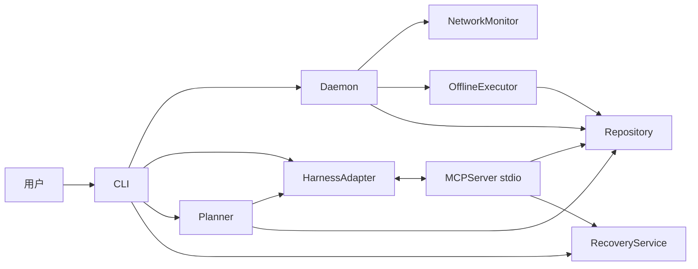

# 设计：CLI、Daemon、MCP 与 Harness

完整审阅稿；真实最小结构化请求已通过，完整云规划与断网恢复尚未验收。

## 概览
CLI/daemon/MCP 以同一本地账本共享事实。daemon 是网络状态和自动离线派发的唯一所有者；MCP 只调用领域服务，不另起后台执行器。规划先支持导入和提示词导出，再增加受限的现有 Harness 非交互适配器。

不实现透明 HTTP/TLS 代理，不声称拦截 Harness 所有网络调用。用户看到的是协作状态、受控本地进程和可恢复工作，而非不存在的云端暂停能力。

## Boundary Commitments

### 本规格拥有
CLI、Daemon、HarnessAdapter、MCPServer、Planner、应用组合、交付文档及端到端验证。

### Out of Boundary
不拥有 schema/迁移、网络计数算法、动作策略与回滚细节，不绕开上游 Repository 或 Policy。

### Allowed Dependencies
foundation 和 execution 的公开接口、typer、MCP SDK、psutil、pywin32。规划复用已安装 CLI 的既有认证，不引入自管云密钥数据库。直接云 API 接入属于额外适配器，需新 spike 和凭据门禁。

### Revalidation Triggers
CLI 参数变化、MCP schema 变化、会话绑定方式、Harness 版本、daemon 锁/心跳或规划输出格式变化时，重跑 SDK stdio、fake harness 和对应真实客户端验收。

## 架构

不开放 TCP 服务，不增加跨进程 HTTP 身份验证面。状态事件写账本供 wrapper/MCP 轮询；单进程内 asyncio.Condition 唤醒等待者，跨进程最长 250ms 查询一次最新序列；该轮询只用于状态/事件，不重复写日志。

## File Structure Plan

| 文件 | 职责 |
|---|---|
| src/yunyi/cli.py、__main__.py | Typer 七类命令及进程退出码 |
| src/yunyi/app.py | 依赖组合，唯一接线位置 |
| src/yunyi/daemon.py | 所有者锁、网络循环、执行交接、心跳 |
| src/yunyi/wrapper.py | 受管 Harness 启停与终端继承 |
| src/yunyi/harness.py | generic/claude/codex 能力描述与版本检查 |
| src/yunyi/mcp_server.py | 八项工具、会话绑定、结构化错误 |
| src/yunyi/planner.py | 预算、提示词、输出验证、计划提交 |
| src/yunyi/planner_adapters.py | 导入、提示词导出、Claude/Codex 非交互调用 |
| src/yunyi/prompts/plan.txt、recover.txt | 打包的中文模板与 schema 版本 |
| tests/integration/test_cli.py、test_daemon.py、test_wrapper.py、test_mcp.py、test_planner.py | 分别测试真实接口组合 |
| tests/fixtures/fake_harness.py、probe_server.py、fake_planner.py | 可控轨迹和协议，不进入产品包 |
| tests/e2e/test_minimum_loop.py、test_train_scenario.py | 跨进程、文件与账本的完整闭环 |
| tools/verify_harness.py | 显式启用的真实兼容性验收与证据输出 |
| README.md、docs/troubleshooting.md、docs/compatibility.md | 中文安装、运行、限制与排障 |
| examples/config.toml、plan.json、claude-mcp.json、codex-mcp.toml | 对应当前 schema 的可验证示例 |
| LICENSE、pyproject.toml | MIT 与 CLI entry point/package data 接线 |

pyproject 只由当前 integration 接线任务修改；其他并发候选不碰 app.py、manifest 和共享 fixtures。

## 组件与接口

### CLI

| 命令 | 主要输入 | 结果与错误 |
|---|---|---|
| run --session ID -- ARGV | 工作区、Harness argv | 启动/附着 daemon，运行 wrapper，传播子进程退出码 |
| status --session ID [--json] | ID | 状态、age、任务统计、限制；未知会话 code 2 |
| plan --session ID --task TEXT [--provider import/claude/codex] [--file PATH] [--emit-prompt] | 任务及明确 provider | 有效计划或提示词；不自动批准执行 |
| offline-exec --session ID [--approve-task ID] | 本地审批及会话 | 串行执行报告；非终端不得交互批准 |
| recover --session ID [--evaluate] [--decision PATH] | 报告或云评估或本地决策 | 核对报告；决定绑定版本 |
| mcp --session ID | stdio 与绑定会话 | stdout 仅 JSON-RPC |
| daemon [--stop] | 数据库路径及锁 | 前台运行或向已验证所有者发停止请求 |

退出码：0 成功、2 配置/输入/会话错误、3 unavailable/timeout、4 approval/unknown/conflict、5 存储或内部故障。run 在已成功启动 Harness 时传播原退出码；wrapper 自己的失败使用以上码并注明来源。

审批使用本地终端展示 action hash、精确 argv、写入列表及回滚能力。没有通用自动批准所有危险动作选项。无 provider 时默认 emit-prompt，不根据当前登录账户静默发起云调用。

### Daemon
`async serve(config: Config, stop: Event) -> None`。
以数据库绝对路径 hash 的 OS 文件锁做唯一性保障。runtime_owners 存启动 UUID、pid、create_time、每秒心跳；锁而非时间是互斥依据。wrapper 启动隐藏子进程 `pack311 -m yunyi daemon`，等待最多五秒出现当前 generation 心跳；启动超时清理自己创建的进程并报错，不误杀已有 daemon。

状态变化事务写 network_events。OFFLINE 时关闭云规划入口，向 wrapper 发交接请求，只有执行层验证 HandoffEvidence 后才启动写步骤。RECOVERING 时立即设置 executor.stop，新任务停止领取，发可见提示；当前任务按其 deadline 收尾，随后生成恢复报告。稳定窗口足够且启用了云评估时请求 Planner。

多个会话按创建时间公平轮询，每工作区至多一个执行器；单一 daemon 网络采样按 primary_target 分组复用，事件仍按 session 记账。单会话 MVP 先验收，多会话在后续任务做冲突测试。

### HarnessAdapter 与 wrapper

`capabilities() -> HarnessCapabilities`；`start(argv, env, cwd) -> HarnessHandle`；`request_pause(handle) -> PauseResult`；`resume(handle, pause_record) -> ResumeResult`；`wait(handle) -> int`。

Capabilities：name、version、interactive_tty、mcp_stdio、structured_plan、cooperative_handoff、process_suspend、remote_request_control=false。只有实测字段标 verified。

- 不修改 argv 内容；Windows .cmd/.ps1 启动器需要解析对应真实 node/exe 入口，不在 shell 字符串插值用户参数。无法安全解析则拒绝并提示真实可执行文件路径。
- 交互 run 继承父控制台 stdio，不捕获并重放 TTY；无 TTY 时明确以管道模式运行，不能承诺所有交互特性。窗口及 Ctrl+C 行为纳入真实验收。
- 环境继承只用于用户明确运行的 Harness，增加 YUNYI_SESSION_ID、YUNYI_DB_PATH、YUNYI_OFFLINE_MODE；不得记录全环境。运行后不能靠改变父环境影响已启动进程，动态状态通过 MCP/事件提供。
- psutil best_effort 暂停先验证 root 身份，登记后代及 create_time，暂停 root 后逐个受管后代，重新核查；仅恢复 pause_record 中由本系统暂停的存活身份。失败返回 partial，不触发自动写入授权。
- 当前真实 Claude/Codex 不假定支持 cooperative_handoff；fake harness 通过协议 ack 测合作路径，真实客户端默认提示接管或由用户结束 Harness 后手动 offline-exec。
- 原始在途云请求、远端推理与计费不被暂停；恢复时若连接失效，提示使用客户端自有 resume。不会在活跃进程上另起重复会话。

### MCPServer

SDK FastMCP 1.30.0，八项工具全部用严格 Pydantic 输入和具名输出模型；不返回裸 dict。启动参数/环境绑定一个已存在 session 和 workspace。相同 OS 用户可以读其本地文件，此工具不冒充多租户安全边界。

| 工具 | 输入字段（均含 session_id） | 输出/作用 |
|---|---|---|
| yunyi_get_state | session_id | NetworkSnapshot + daemon_health |
| yunyi_wait_for_stable | min_seconds[0..300], timeout_seconds[0..300] | satisfied、snapshot、reason；允许取消 |
| yunyi_save_plan | plan:Plan | PlanReceipt，默认 draft/pending_approval |
| yunyi_enqueue_tasks | plan_id、task_ids | 每项 accepted/pending_approval/rejected，不执行 |
| yunyi_get_pending_tasks | limit[1..100]、cursor | 无令牌任务列表、next_cursor |
| yunyi_checkpoint | task/step标识、attempt_id、version、state摘要 | observation checkpoint；不能推进执行步号 |
| yunyi_rollback | checkpoint_id、operation_id、report_version | 检查本地审批后返回回滚结果，否则 approval_required |
| yunyi_report_result | task/step标识、attempt_id、version、result摘要 | 已验证 attempt 的外部观察，不能替代执行器 finish_step 的终态提交 |

写工具每次重新校验绑定会话、归属与当前版本。attempt 信息仅传给受管 worker 的专用上下文，不由 pending_tasks 泄漏；不持有有效凭证的 Harness 可以查询但不能伪造完成。非执行器观察只存事实，不直接使步骤 succeeded。

统一 ErrorEnvelope：code、message、retryable、correlation_id；协议级输入错误使用 SDK 标准错误，领域错误用 isError=true + 类型化安全内容。日志全部 stderr/文件；禁止 stdout 调试 print。

### Planner
`async create_plan(session_id, task, provider, deadline) -> PlanReceipt`；`async evaluate_recovery(session_id, report_version, provider) -> RecoveryProposal`。

budget = min(config.max_plan_seconds=300, snapshot.stable_window_seconds)，剩余预算必须大于连接/解析保留的五秒；陈旧或非稳定状态立即拒绝。调用总 deadline 使用 monotonic；最多一次明确可重试的无输出失败，且剩余预算允许才重试。失联或超时取消本地适配器并记录远端状态 unknown，绝不声称未产生远端调用。

提示词含网络实际状态、估计/置信度、预算、风险偏好、允许动作 profile、schema_version、明确非幂等/回滚约束；不把任意 stdout 当系统指令。恢复提示词只含授权的脱敏摘要、report_version 与待核对列表。模型输出严格解析 JSON，禁止 Markdown fenced text 自动宽松提取；输入上限 1MiB，禁止未知字段。

规划适配器：
- import：本地 JSON fixture，与云结果走同一验证/保存路径。
- prompt：输出完整模板和 schema，由现有 Harness 通过 MCP 保存计划。
- claude：本机2.1.282原生exe已真实验证 `-p --safe-mode --tools "" --strict-mcp-config --mcp-config <空配置> --setting-sources "" --output-format json --json-schema`；读取顶层structured_output并验证schema，不从usage或result文本猜取JSON。
- codex：本机0.155.0-alpha.9.2已真实验证 `exec --sandbox read-only --ephemeral --output-schema --output-last-message --ignore-user-config`；使用项目外独立临时规划目录与schema文件，从stdin传prompt、文件读最终结果。最小请求成功不代表任意模型和长期网络可靠。
- 所有真实适配器上线前都要验证工具禁用/只读约束、无额外 MCP 服务、无任意写入、认证可用、schema envelope、退出清理。当前最小请求无工具/命令执行，不能证明抵御恶意模型的沙箱隔离；参数改变或超出已验能力时先补spike并返回capability_unverified。

SDK/客户端的当前官方资料在 research.md。文档示例按实际安装版本验收；不写死原稿的过期或含糊模型别名，model 可选显式配置，否则沿用既有 Harness 设置。

## 最小闭环与后续验收

最小闭环：初始化会话 → MCP 保存并入队已本地批准 fixture 计划 → fake harness 启动 → 本地探针稳定 → 断网 → 合作交接 ACK → 一次 file_write → 前后检查点 → 恢复首成功 → 五秒内提示/停止新领取 → 报告 → 进程重启 → 已完成步骤不重复。最后请求精确回滚，恢复原脏内容。

快测用注入时钟完成状态算法，跨进程最小闭环用真实秒级缩短参数；完整列车轨迹单独使用默认三秒探测和 30s/60s 真实时间，不把加速测试冒充原始指标。

真实兼容性：显式 `tools/verify_harness.py --harness claude|codex --allow-cloud`，先显示测试范围、样本数及可能调用云服务；不得把 mock 请求计入真实统计。原稿 >95% 目标用至少100个处于稳定窗口的真实规划请求评估，需成功至少96次，记录总数/认证/限流/网络/结构错误。默认不自动运行高调用量验收，未运行则标未验收且阻止完整发布声明。

## 错误与运行策略
daemon 丢失→stale→阻止自动派发；MCP 断开只停止该工具请求，不杀共享 daemon；wrapper 退出释放自己持有的暂停记录，不恢复其他工具暂停的进程。磁盘故障禁止执行。任何测试仅操作临时目录/受管进程，不切断主机实际网络。

## 需求追踪

| 需求 | 组件 | 验证 |
|---|---|---|
| 1.1 | CLI、发布包、文档 | 七命令help、wheel安装、示例执行、许可证 |
| 1.2, 1.3, 1.4 | Wrapper、Daemon | argv、退出码、唯一锁、重启、陈旧状态 |
| 2.1, 2.2, 2.3, 2.4, 2.5 | HarnessAdapter、Daemon | 父子进程、partial、五秒提示、恢复身份与能力表 |
| 3.1, 3.2, 3.3, 3.4, 3.5 | MCPServer | SDK真实stdio、全部工具、越权/过期/无批准负例 |
| 4.1, 4.2, 4.3, 4.4, 4.5 | Planner、适配器、提示词 | 预算、网络切换、恶意计划、导入、云评估失败 |
| 5.1, 5.2 | IntegrationTests | 真实轨迹、最小闭环、重启与回滚 |
| 5.3, 5.4 | 验收工具/兼容性报告 | 两种真实客户端、真实请求分母与失败分类 |
| 5.5 | 开发门禁 | RED/GREEN hash、独立审查、闭环通过后才提高并发 |

## 交付
README 给出 Windows conda 安装、初始化、只导出提示词、导入 fixture、执行/恢复、Claude/Codex MCP 配置（用户自行选择写入，不自动修改全局设置）。配置与计划示例作为测试数据实际加载。发布包包含提示词和迁移 SQL；不包含 .tools、spike、凭据、运行账本或用户快照。
